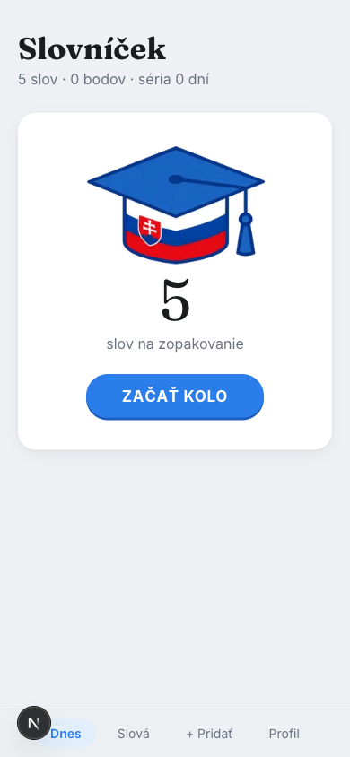
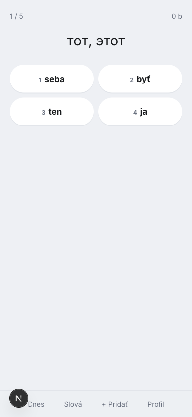
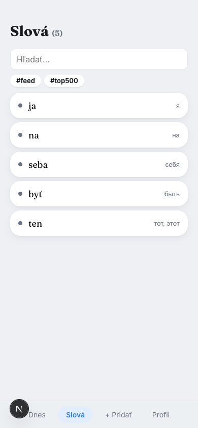

# Slovníček

Personal Slovak vocabulary trainer for Russian speakers. Offline-first PWA:
collect words, review them in auto-graded quiz rounds scheduled by FSRS, and
watch prompts switch from Russian translations to Slovak-only definitions as
words mature. A bundled bank of the 2,000 most frequent Slovak words feeds
you new vocabulary daily — no lesson plans, no curation.

  
  
  

## Stack

Next.js 15 (App Router, webpack) · React 19 · Dexie (IndexedDB) · ts-fsrs ·
Serwist · Supabase (Google auth + sync) · framer-motion · vitest

## Development

    npm install
    npm run dev       # http://localhost:3000
    npm test          # unit tests
    npm run build

Copy `.env.local.example` to `.env.local` and fill Supabase credentials to
enable sync (see `docs/setup-supabase.md`). The app is fully usable without
them — everything is stored locally.
